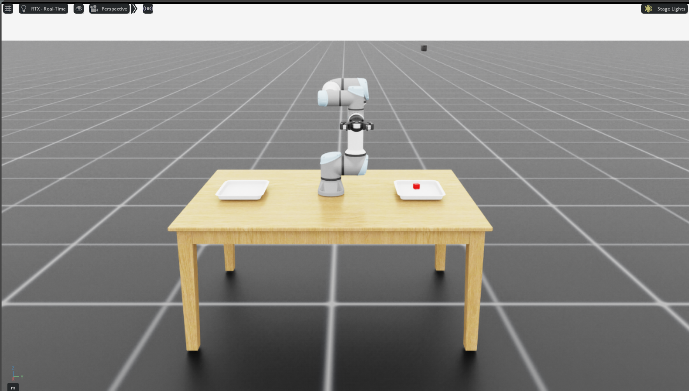
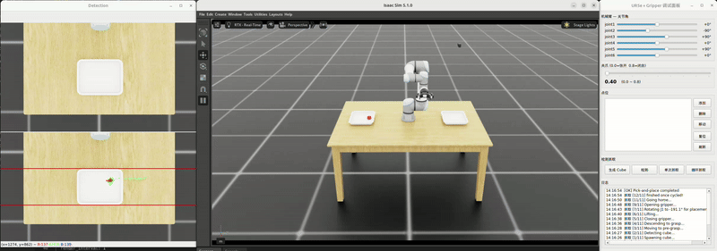
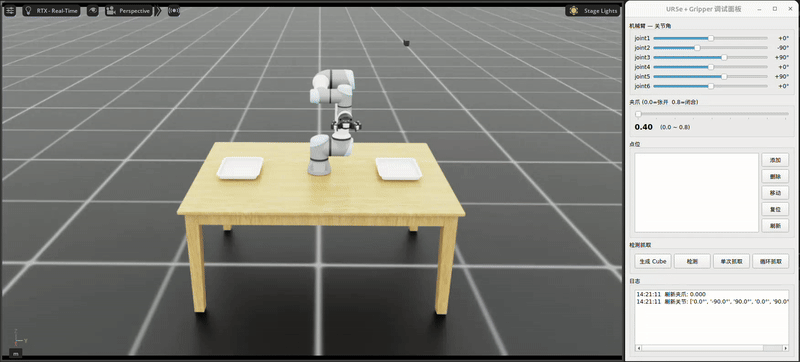

# ur5e_gripper

UR5e 机械臂 + Robotiq 2F-85 自适应夹爪的 ROS 2 Humble 仿真项目，集成 Isaac Lab 物理仿真。
提供三种可互换的控制模式：**MoveIt 规划**（`src/moveit/`）、**ACT 端到端策略**（`src/act/`）与
**Diffusion Policy**（`src/diffusion/`），三者暴露同一个 `/pick_and_place` 接口。



## 简介

这是一个学习机器人抓取控制的仿真项目：UR5e 从左侧托盘抓取随机位置和朝向的红色 cube，将其放到
另一侧托盘并回到 home。项目的重点是用同一套机器人、相机、场景和 ROS 接口，对比三种控制方法：

```text
MoveIt     RGB-D 目标检测 -> 几何位姿 -> 轨迹规划
ACT        RGB + 关节状态 -> 直接预测关节动作块
Diffusion  两帧 RGB + 关节状态 -> 生成关节动作块
```

你可以从中学习 ROS 2 节点与 action/service、IsaacLab 仿真、MoveIt 规划、LeRobot 数据采集与转换，
以及 ACT 和 Diffusion Policy 的训练、离线评估和闭环部署。项目只在仿真中验证，不代表真实机器人性能。

## 演示

### MoveIt 规划



### ACT 端到端控制



## 快速开始

```bash
git clone --recurse-submodules <your-repository-url>
cd ur5e_gripper

source /opt/ros/humble/setup.bash
colcon build --symlink-install

./run.sh              # MoveIt + IsaacLab
./run.sh --act        # 需要本地 ACT checkpoint
./run.sh --diffusion  # 需要本地 Diffusion checkpoint
```

如果仓库不是通过 `--recurse-submodules` 克隆，执行：

```bash
git submodule update --init --recursive
```

`raw_data/`、`lerobot_data_rgb_abs/` 与 `outputs/` 都只在本地保存，不随仓库发布。ACT 与 Diffusion
模式需要先自行采集数据、训练 checkpoint，或通过 `ACT_CHECKPOINT`、`DIFFUSION_CHECKPOINT` 指向已有
本地 checkpoint。

## 项目结构

```
ur5e_gripper/
├── src/
│   ├── moveit/                       # MoveIt 规划控制模式
│   │   ├── description/              # URDF/XACRO + 网格
│   │   ├── moveit_config/            # MoveIt 2 配置与启动
│   │   ├── planning/                 # planning_node（/plan_execute）
│   │   ├── orchestrator/             # 11 步流水线（/pick_and_place）
│   │   ├── perception/               # 红色物体检测（/detect_object）
│   │   ├── pymoveit2/                # Python MoveIt 2 接口
│   │   └── trac_ik/                  # TRAC-IK 运动学插件
│   ├── act/                          # ACT 端到端控制模式（见 src/act/README.md）
│   ├── diffusion/                    # Diffusion Policy 控制模式（见 src/diffusion/README.md）
│   ├── custom_msgs/                  # 服务/动作定义（三种模式共用）
│   └── recorder/                     # LeRobot 原始数据采集（不随 run.sh 启动）
├── isaaclab/src/                     # Isaac Lab 仿真入口 / 控制 / 桥接
├── mujoco/                           # MuJoCo ros2_control 后端
├── script/                           # panel.py、ACT/Diffusion 推理服务
├── tools/lerobot_convert.py          # raw_data → LeRobotDataset
├── test/                             # ACT/Diffusion 离线评估、loss 曲线
├── run.sh                            # 一键启动
└── install/                          # colcon 编译产物
```

## 依赖

```bash
# ROS 2 Humble
sudo apt install ros-humble-ros-base ros-humble-moveit ros-humble-ros2-control ros-humble-ros2-controllers

# PySide6 (GUI 调试面板)
pip3 install PySide6

# MuJoCo ros2_control 后端
sudo apt install ros-humble-mujoco-ros2-control \
  ros-humble-mujoco-vendor ros-humble-mujoco-ros2-control-plugins
```

项目跨三个 Python 运行时，`run.sh` 需要它们都存在（可用同名环境变量覆盖）：

| 用途                       | conda 环境                        | Python | 说明                                      |
| -------------------------- | --------------------------------- | ------ | ----------------------------------------- |
| Isaac Lab 仿真             | `ISAACLAB_ENV`（默认 `isaaclab`） | 3.11   | 自带 ROS 2 库，不要与系统 ROS 混用        |
| ACT / Diffusion 推理与训练 | `LEROBOT_ENV`（默认 `lerobot`）   | ≥3.12  | LeRobot 要求 ≥3.12，无法与系统 ROS 同进程 |
| 其余 ROS 节点 / 面板       | 系统环境                          | 3.10   | `/opt/ros/humble`                         |

`CONDA_ROOT` 默认 `/home/dev/miniconda3`。

## 学习项目说明

这是用于学习 ROS 2、IsaacLab、MoveIt、ACT 与 Diffusion Policy 闭环控制的仿真项目，不是面向生产或
真实机器人的软件包。仓库发布代码、场景配置和训练/评估脚本；数据与模型权重仅在本地生成和使用。

以下内容不随仓库发布：

```text
raw_data/       原始 RGB/深度录制数据
lerobot_data_rgb_abs/  本地 LeRobot 训练数据集
outputs/        ACT 与 Diffusion checkpoint、训练日志
build/ install/ log/  colcon 生成产物
```

克隆仓库后可直接构建代码和运行 MoveIt 模式。ACT 与 Diffusion 需要先本地采集/转换数据并训练自己的
checkpoint，或通过 `ACT_CHECKPOINT`、`DIFFUSION_CHECKPOINT` 指向已有本地 checkpoint。

上游机器人描述、资产与驱动位于 `third_party/`。首次克隆后初始化子模块：

```bash
git submodule update --init --recursive
```

## 编译

```bash
cd ~/work/ur5e_gripper
source /opt/ros/humble/setup.bash
colcon build --symlink-install
```

## 一键启动

```bash
./run.sh                 # 默认 Isaac Sim（MoveIt 模式）
./run.sh --mujoco        # MuJoCo 后端（MoveIt 模式）
./run.sh --act           # ACT 端到端模式
./run.sh --diffusion     # Diffusion Policy 端到端模式
```

`run.sh` 会导出 `ROS_DOMAIN_ID`（默认 46，可用同名环境变量覆盖）。

| 模式                 | 进程数 | 启动顺序                                                                                             |
| -------------------- | ------ | ---------------------------------------------------------------------------------------------------- |
| `--isaacsim`（默认） | 7      | MoveIt → Bridge → Planning → Perception → IsaacLab → Orchestrator → Panel                            |
| `--mujoco`           | 6      | MoveIt → MuJoCo → Perception → Planning → Orchestrator → Panel                                       |
| `--act`              | 5      | ACT 推理服务 → IsaacLab `--act` → act_orchestrator → act_ros_adapter → Panel                         |
| `--diffusion`        | 5      | Diffusion 推理服务 → IsaacLab `--diffusion` → diffusion_orchestrator → diffusion_ros_adapter → Panel |

按 `Ctrl+C` 全部停止。

## 三种控制模式

三种模式都实现同一个 `/pick_and_place`（`custom_msgs/action/PickAndPlace`）action，
所以面板的单次/循环抓取逻辑通用。**一个 goal = 一轮**；循环模式由面板在成功后重发 goal，
失败则停止循环。

|            | MoveIt 模式（`--isaacsim` / `--mujoco`） | ACT 模式（`--act`）      | Diffusion 模式（`--diffusion`） |
| ---------- | ---------------------------------------- | ------------------------ | ------------------------------- |
| 决策       | 感知检测 → 几何位姿 → MoveIt 规划        | 端到端策略直接输出关节角 | 两帧观测条件下采样关节角动作块  |
| 频率       | 低频（一次规划一整段轨迹）               | 15Hz 连续闭环            | 15Hz 连续闭环                   |
| 完成判定   | 11 步流水线跑完                          | 关节先离开、再回到 home  | 关节先离开、再回到 home         |
| 需要的感知 | RGB + 深度 + HSV 检测                    | 只要 RGB + 关节状态      | 两帧 RGB + 两帧关节状态         |

ACT 模式的完整说明（ACT 原理、数据流水线、训练与评估、换模型要改什么）见
[`src/act/README.md`](src/act/README.md)；Diffusion 模式说明见
[`src/diffusion/README.md`](src/diffusion/README.md)。

### 模型选择与当前限制

模型选择取决于任务形态、数据规模和控制精度，而不仅是模型参数量。当前数据集包含 52 个单任务
pick-and-place episode：固定场景中抓取红色 cube、放入目标托盘并回 home。

| 场景                             | 更合适的方向      | 原因                                                                       |
| -------------------------------- | ----------------- | -------------------------------------------------------------------------- |
| 固定、重复、要求精确抓取的单任务 | ACT               | 直接稳定地复现示范关节轨迹，当前任务下通常比采样式策略平滑。               |
| 存在多条合理轨迹、动作分布更复杂 | Diffusion Policy  | 可以生成多模态动作块，但需要更多高质量示范和稳定的 chunk 衔接。            |
| 同一机器人需要按文字执行不同任务 | VLA，例如 SmolVLA | 将语言指令、图像和关节状态一起作为条件；固定文字指令对单任务没有额外信息。 |

Diffusion 模式默认使用 20 步去噪、32 步动作块和 15 Hz 发布。为避免旧观测造成阶段错乱，默认在
当前动作块耗尽后才用最新两帧观测生成下一块；相邻块的前 4 个机械臂目标会平滑融合，夹爪需要连续
3 个预测确认并只按 `open -> closed -> released` 状态推进。相关默认值可在 `run.sh` 顶部手动修改：

```bash
DIFFUSION_INFERENCE_STEPS=20
DIFFUSION_PREFETCH_THRESHOLD=0
DIFFUSION_BLEND_STEPS=4
DIFFUSION_GRIPPER_CONFIRM_STEPS=3
```

`/pick_and_place` 的 ACT 与 Diffusion 成功条件目前是机械臂离开 home 后回到 home，**不等同于**
cube 已被抓住或已落入目标托盘。抓偏、空夹或滑落仍需要通过指尖接触力、cube 位姿或目标托盘区域
增加额外验证。离线动作 MAE 也只能衡量轨迹接近程度，不能代替真实抓取成功率。

---

## 测试命令（MoveIt 模式）

`/plan_execute` 只在 MoveIt 模式（`--isaacsim` / `--mujoco`）下可用；ACT 与 Diffusion 模式由策略直接控制。

先确保 `run.sh` 已启动且 `planning_node` 显示 `Planning node ready`，然后新开终端：

```bash
source /opt/ros/humble/setup.bash
source ~/work/ur5e_gripper/install/setup.bash
export ROS_DOMAIN_ID=46
```

### 机械臂 — IK 笛卡尔空间

```bash
# 相对移动: 沿 X 轴 +10cm（xyz 单位米, rpy 单位度）
ros2 service call /plan_execute custom_msgs/srv/PlanExecute \
  "{command_type: ik_rel, data: '0.1 0 0 0 0 0'}"
```

```bash
# 绝对位姿
ros2 service call /plan_execute custom_msgs/srv/PlanExecute \
  "{command_type: ik_abs, data: '0.3 -0.2 0.4 180 0 90'}"
```

### 机械臂 — FK 关节空间

```bash
# 绝对关节角（单位度）
ros2 service call /plan_execute custom_msgs/srv/PlanExecute \
  "{command_type: fk_abs, data: '0 -90 90 0 90 0'}"
```

```bash
# 相对关节增量
ros2 service call /plan_execute custom_msgs/srv/PlanExecute \
  "{command_type: fk_rel, data: '0 -10 10 0 0 0'}"
```

### 夹爪

```bash
# 全开  |  半开  |  全关
ros2 service call /plan_execute custom_msgs/srv/PlanExecute \
  "{command_type: gripper, data: '0.0'}"
```

```bash
ros2 service call /plan_execute custom_msgs/srv/PlanExecute \
  "{command_type: gripper, data: '0.4'}"
```

```bash
ros2 service call /plan_execute custom_msgs/srv/PlanExecute \
  "{command_type: gripper, data: '0.8'}"
```

> `data` 范围：0.0（全开）～ 0.8（闭合）

---

## 命令速查

| command_type | data 格式                    | 单位     |
| ------------ | ---------------------------- | -------- |
| `ik_rel`     | `dx dy dz droll dpitch dyaw` | 米 / 度  |
| `ik_abs`     | `x y z roll pitch yaw`       | 米 / 度  |
| `fk_rel`     | `dj1 dj2 dj3 dj4 dj5 dj6`    | 度       |
| `fk_abs`     | `j1 j2 j3 j4 j5 j6`          | 度       |
| `gripper`    | `position`                   | 0.0～0.8 |

---

## GUI 测试面板

```bash
# 必须用系统 Python 3.10，不能用 conda
conda deactivate
source /opt/ros/humble/setup.bash
source ~/work/ur5e_gripper/install/setup.bash
export ROS_DOMAIN_ID=46
python3 ~/work/ur5e_gripper/script/panel.py
```

“单次抓取”发送一次 `/pick_and_place`；“循环抓取”会在每轮成功后自动启动下一轮，运行中点击“停止循环”可取消当前任务。“复位”调用 `/reset` 清除方块并把机械臂送回 home（三种模式通用）。

---

## 数据采集、训练与评估

策略训练在 conda `lerobot` 环境执行，不是系统 ROS。本地转换后的数据集可以直接用于以下命令；原始
数据采集和转换只在需要扩充数据时执行。

```bash
# 1. 采集：单独启动 recorder（不随 run.sh 启动），在 MoveIt 模式下跑循环抓取即可累积 episode
ros2 run recorder recorder_node

# 2. 转换：raw_data -> LeRobotDataset（裁剪开头静止段、标签改为绝对下一状态）
python tools/lerobot_convert.py

# 3. 训练 ACT
lerobot-train --dataset.repo_id=ur5e_pick_place \
  --dataset.root=/home/dev/work/ur5e_gripper/lerobot_data_rgb_abs \
  --dataset.eval_split=0.2 --policy.type=act --policy.use_vae=false \
  --policy.chunk_size=50 --policy.n_action_steps=10 --policy.device=cuda \
  --policy.push_to_hub=false --batch_size=32 --steps=30000 --env_eval_freq=0 \
  --wandb.enable=false \
  --output_dir=/home/dev/work/ur5e_gripper/outputs/ur5e_act_rgb_abs_novae

# 4. 离线评估（对比"保持当前位置"基线）
python test/act_smoke_test.py \
  --checkpoint outputs/ur5e_act_rgb_abs_novae/checkpoints/030000/pretrained_model \
  --dataset-root lerobot_data_rgb_abs
```

### Diffusion 训练与评估

```bash
conda activate lerobot

lerobot-train --dataset.repo_id=ur5e_pick_place \
  --dataset.root=/home/dev/work/ur5e_gripper/lerobot_data_rgb_abs \
  --dataset.video_backend=pyav --dataset.eval_split=0.2 \
  --policy.type=diffusion --policy.n_obs_steps=2 \
  --policy.horizon=64 --policy.n_action_steps=32 --policy.device=cuda \
  --policy.push_to_hub=false --batch_size=64 --steps=30000 --env_eval_freq=0 \
  --wandb.enable=false \
  --output_dir=/home/dev/work/ur5e_gripper/outputs/ur5e_diffusion_abs

python test/diffusion_smoke_test.py \
  --checkpoint outputs/ur5e_diffusion_abs/checkpoints/last/pretrained_model \
  --dataset-root lerobot_data_rgb_abs --num-inference-steps=20
```

离线评估只用于检查 checkpoint 是否优于保持当前位置基线。真实抓取需要在随机 cube 位姿下单独记录
抓取、搬运和放置成功率。

详细原理与踩坑记录见 [`src/act/README.md`](src/act/README.md)。

---

## 架构

### MoveIt 模式（`--isaacsim` / `--mujoco`）

```
GUI / ros2 service call
        │
        ▼
   planning_node  ───────── action ──────────▶  bridge_node (IsaacLab)
   (MoveIt 规划)                              │ topics
        │                                     ▼
        └──── action ─────▶ MuJoCo / IsaacLab control
                                             │
                                             ▼
                                           仿真
```

### ACT 模式（`--act`）

```
Panel ──/pick_and_place──▶ act_orchestrator
                             │  1. /reset + /spawn_cube          → control_node
                             │  2. /act_ros_adapter/prepare      → adapter（预热 chunk）
                             │  3. /isaaclab/act/enabled = True  → adapter + control_node
                             │  4. 等关节回 home 后 enable=False
                             ▼
                        act_ros_adapter ──15Hz /isaaclab/act/joint_target──▶ control_node
                             │                                                   │
                             └──HTTP /infer_chunk──▶ script/act_policy_server.py  ▼
                                                      (conda lerobot, ACT 策略)  仿真
```

## 许可证与安全

- 本项目中由维护者编写的代码使用 [Apache-2.0](LICENSE)。发布前请将 `LICENSE` 附录中的
  `Copyright [yyyy] [name of copyright owner]` 占位符替换为实际权利人信息。
- `third_party/`、URDF、网格、USD 资产和其他上游组件继续适用各自目录中的许可证；根 Apache-2.0
  许可证不覆盖它们。
- 本项目目前只验证 IsaacLab/MuJoCo 仿真。不要在真实 UR5e 或其他实体机器人上直接运行策略；在实体
  系统部署前必须增加独立的安全限制、急停、碰撞检查和抓取成功验证。
